# IBD Teal Jewelry — Application Architecture

> Branch: `sqllite`  
> Stack: **Node.js · Express · sql.js (SQLite in-process) · Vanilla JS / jQuery frontend**

---

## Table of Contents

1. [Overview](#overview)
2. [Project Structure](#project-structure)
3. [Tech Stack](#tech-stack)
4. [Database Schema](#database-schema)
5. [API Reference](#api-reference)
6. [User Flow Chart](#user-flow-chart)
7. [Sequence Diagrams](#sequence-diagrams)
   - [Customer Registration](#1-customer-registration)
   - [Customer Login](#2-customer-login)
   - [Browse & Search Products](#3-browse--search-products)
   - [Add to Cart](#4-add-to-cart)
   - [Checkout & Place Order](#5-checkout--place-order)
   - [Payment Processing](#6-payment-processing)
   - [Admin Login](#7-admin-login)
   - [Admin Manage Products](#8-admin-manage-products)
   - [Admin Manage Orders](#9-admin-manage-orders)
8. [Authentication Model](#authentication-model)
9. [Running the Application](#running-the-application)

---

## Overview

IBD Teal Jewelry is a full-stack jewelry e-commerce platform built for the Microsoft Hackathon. It provides:

- A **customer-facing storefront** for browsing jewelry, managing a cart, and placing orders.
- A **mock payment flow** that always succeeds (no external payment gateway).
- An **admin panel** for managing products, categories, and orders.

The entire application runs as a single Express server that serves static HTML/JS files and a REST API. The database is a **SQLite file** (`db/jewelry.db`) managed in-process via `sql.js` — no Docker or external database service is required.

---

## Project Structure

```
IBD-TEAL-Synergy/
├── db/
│   ├── jewelry.db          # SQLite database file (auto-created)
│   ├── schema.sql          # Reference DDL
│   └── seed.js             # Seed script (admin user + sample data)
├── public/                 # Static frontend (HTML + CSS + JS)
│   ├── index.html          # Shop homepage
│   ├── pdp.html            # Product detail page
│   ├── cart.html           # Shopping cart
│   ├── checkout.html       # Checkout form
│   ├── login.html          # Customer login / register
│   ├── order-confirmation.html
│   ├── admin/              # Admin panel pages
│   │   ├── login.html
│   │   ├── dashboard.html
│   │   ├── products.html
│   │   ├── categories.html
│   │   └── orders.html
│   ├── css/style.css
│   └── js/                 # Client-side JS
│       ├── api.js          # Fetch wrapper
│       ├── auth.js         # JWT storage & nav update
│       ├── cart.js
│       ├── checkout.js
│       ├── pdp.js
│       └── admin/
│           ├── admin-api.js
│           └── products.js
├── server/
│   ├── index.js            # Express entry point
│   ├── config/db.js        # sql.js wrapper (init, prepare, transaction)
│   ├── middleware/
│   │   ├── auth.js         # JWT guard (customers)
│   │   └── adminAuth.js    # JWT guard (admins, isAdmin flag)
│   └── routes/
│       ├── authRoutes.js       # POST /register, POST /login
│       ├── productRoutes.js    # GET /products, GET /products/:id
│       ├── categoryRoutes.js   # GET /categories
│       ├── cartRoutes.js       # CRUD /cart
│       ├── orderRoutes.js      # POST /orders, GET /orders/:orderNumber
│       ├── paymentRoutes.js    # POST /payment/process
│       └── admin/
│           ├── authRoutes.js       # POST /admin/auth/login
│           ├── productRoutes.js    # CRUD /admin/products + variants
│           ├── categoryRoutes.js   # CRUD /admin/categories
│           ├── orderRoutes.js      # GET/PUT /admin/orders
│           └── dashboardRoutes.js  # GET /admin/dashboard
├── package.json
└── README.md
```

---

## Tech Stack

| Layer | Technology |
|---|---|
| Runtime | Node.js |
| Web framework | Express 4 |
| Database | SQLite via `sql.js` (in-process, no native binary) |
| Authentication | JSON Web Tokens (`jsonwebtoken`) + `bcryptjs` |
| Session | `express-session` (used for guest cart identity) |
| File uploads | `multer` (product images saved to `server/uploads/products/`) |
| Frontend | Vanilla HTML + CSS + jQuery 3.7 |

---

## Database Schema

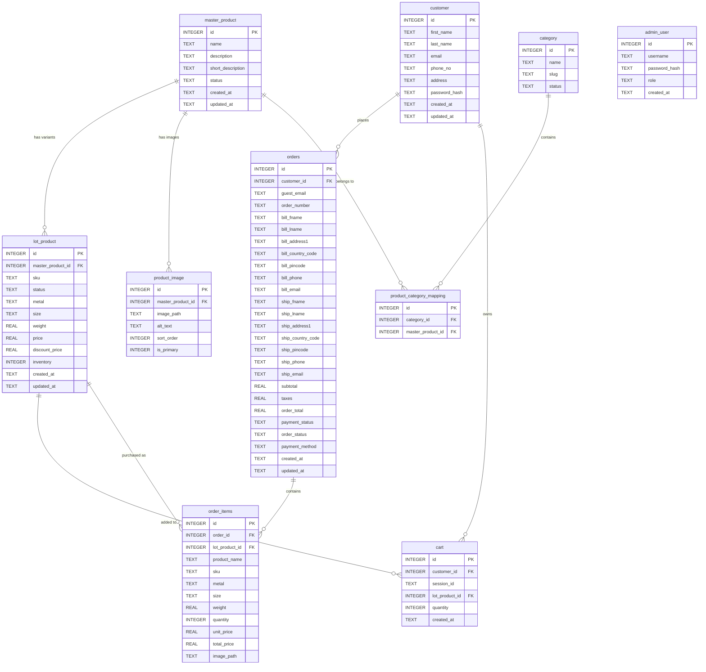

---

## API Reference

### Customer Auth — `/api/auth`

| Method | Path | Auth | Description |
|--------|------|------|-------------|
| POST | `/api/auth/register` | None | Register a new customer account |
| POST | `/api/auth/login` | None | Login; returns JWT |

### Products — `/api/products`

| Method | Path | Auth | Description |
|--------|------|------|-------------|
| GET | `/api/products` | None | List active products (pagination, category filter, search) |
| GET | `/api/products/:id` | None | Get product detail with variants, images, categories |

### Categories — `/api/categories`

| Method | Path | Auth | Description |
|--------|------|------|-------------|
| GET | `/api/categories` | None | List active categories |

### Cart — `/api/cart`

| Method | Path | Auth | Description |
|--------|------|------|-------------|
| GET | `/api/cart` | Optional JWT | Get current cart (by customer or session) |
| POST | `/api/cart` | Optional JWT | Add item to cart |
| PUT | `/api/cart/:id` | Optional JWT | Update item quantity |
| DELETE | `/api/cart/:id` | Optional JWT | Remove item from cart |

### Orders — `/api/orders`

| Method | Path | Auth | Description |
|--------|------|------|-------------|
| POST | `/api/orders` | Optional JWT | Place order from current cart |
| GET | `/api/orders/:orderNumber` | Optional JWT | Get order details |

### Payment — `/api/payment`

| Method | Path | Auth | Description |
|--------|------|------|-------------|
| POST | `/api/payment/process` | None | Process mock payment for an order |

### Admin Auth — `/api/admin/auth`

| Method | Path | Auth | Description |
|--------|------|------|-------------|
| POST | `/api/admin/auth/login` | None | Admin login; returns JWT with `isAdmin: true` |

### Admin Products — `/api/admin/products`

| Method | Path | Auth | Description |
|--------|------|------|-------------|
| GET | `/api/admin/products` | Admin JWT | List all products |
| GET | `/api/admin/products/:id` | Admin JWT | Get product with variants & images |
| POST | `/api/admin/products` | Admin JWT | Create product (multipart with images) |
| PUT | `/api/admin/products/:id` | Admin JWT | Update product |
| DELETE | `/api/admin/products/:id` | Admin JWT | Soft-delete product |
| POST | `/api/admin/products/:id/variants` | Admin JWT | Add a variant (SKU) |
| PUT | `/api/admin/products/variants/:variantId` | Admin JWT | Update a variant |

### Admin Categories — `/api/admin/categories`

| Method | Path | Auth | Description |
|--------|------|------|-------------|
| GET | `/api/admin/categories` | Admin JWT | List categories |
| POST | `/api/admin/categories` | Admin JWT | Create category |
| PUT | `/api/admin/categories/:id` | Admin JWT | Update category |
| DELETE | `/api/admin/categories/:id` | Admin JWT | Delete category |

### Admin Orders — `/api/admin/orders`

| Method | Path | Auth | Description |
|--------|------|------|-------------|
| GET | `/api/admin/orders` | Admin JWT | List all orders (filterable by status) |
| GET | `/api/admin/orders/:id` | Admin JWT | Get order detail |
| PUT | `/api/admin/orders/:id` | Admin JWT | Update order/payment status |

### Admin Dashboard — `/api/admin/dashboard`

| Method | Path | Auth | Description |
|--------|------|------|-------------|
| GET | `/api/admin/dashboard` | Admin JWT | Aggregated stats + recent orders |

---

## User Flow Chart

The diagram below shows every path a user (customer or admin) can take through the application.

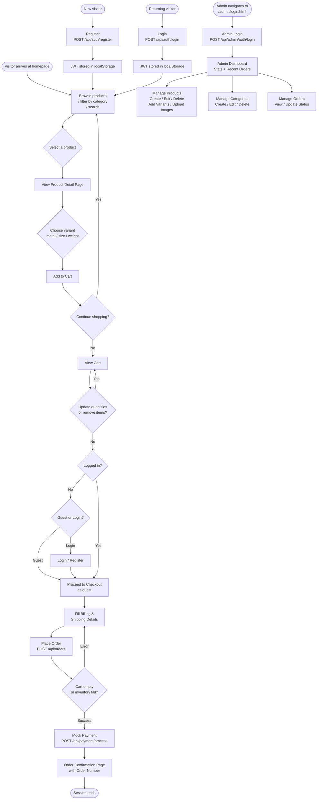

---

## Sequence Diagrams

### 1. Customer Registration

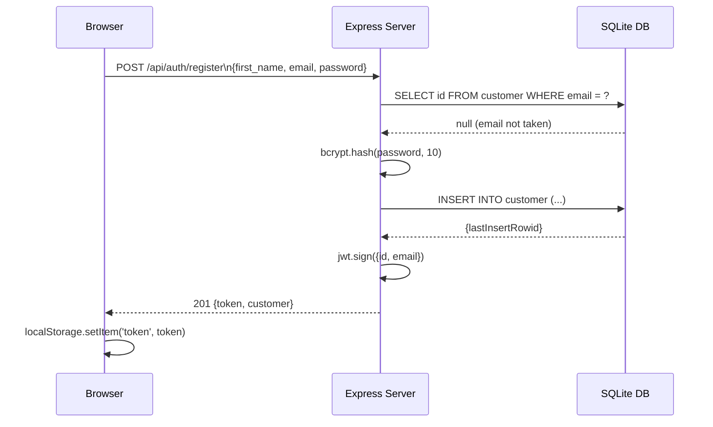

### 2. Customer Login

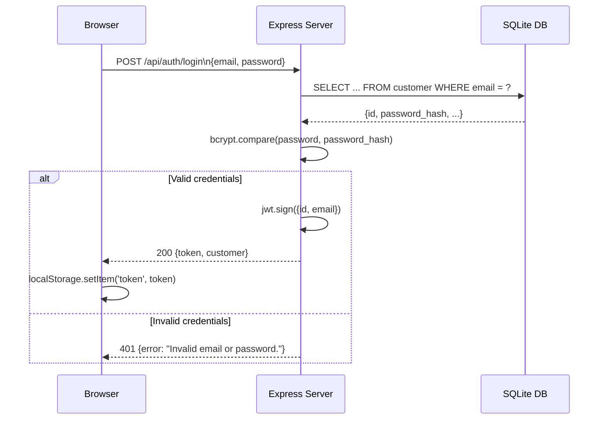

### 3. Browse & Search Products

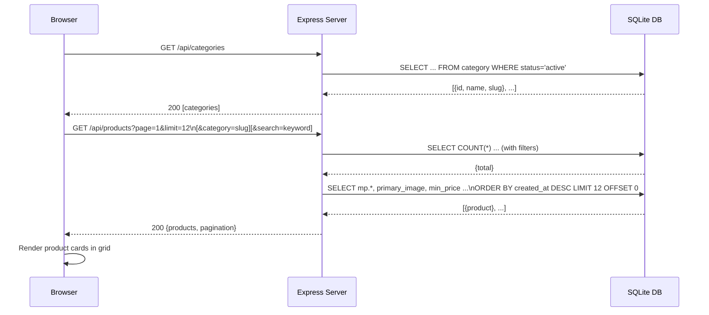

### 4. Add to Cart

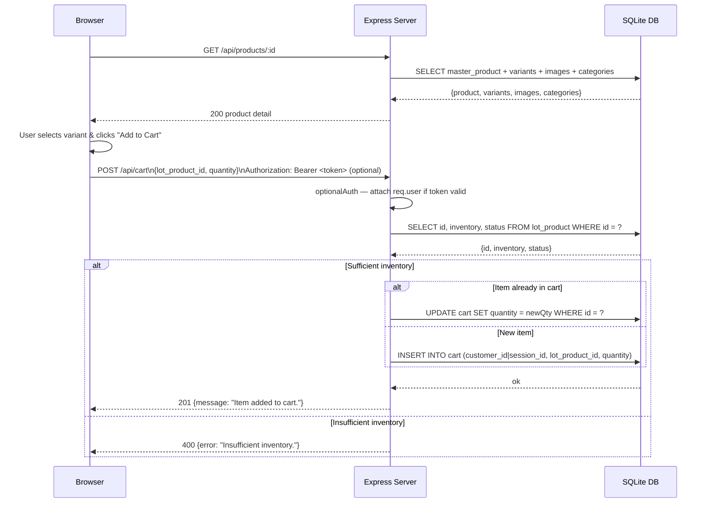

### 5. Checkout & Place Order

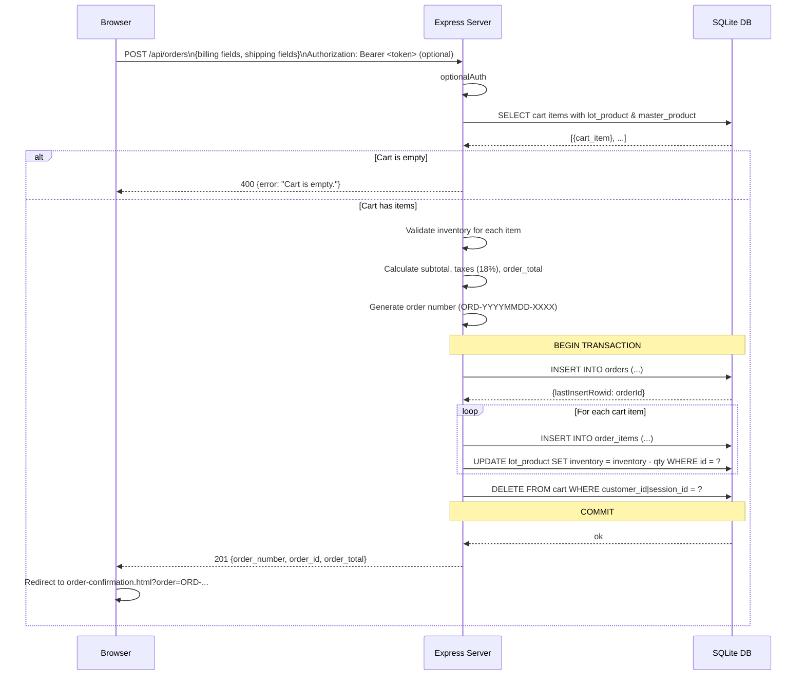

### 6. Payment Processing

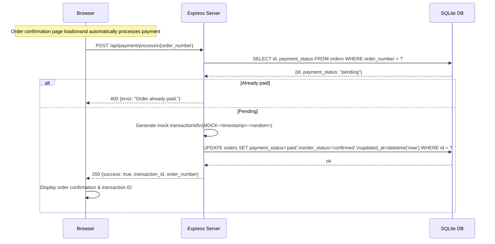

### 7. Admin Login

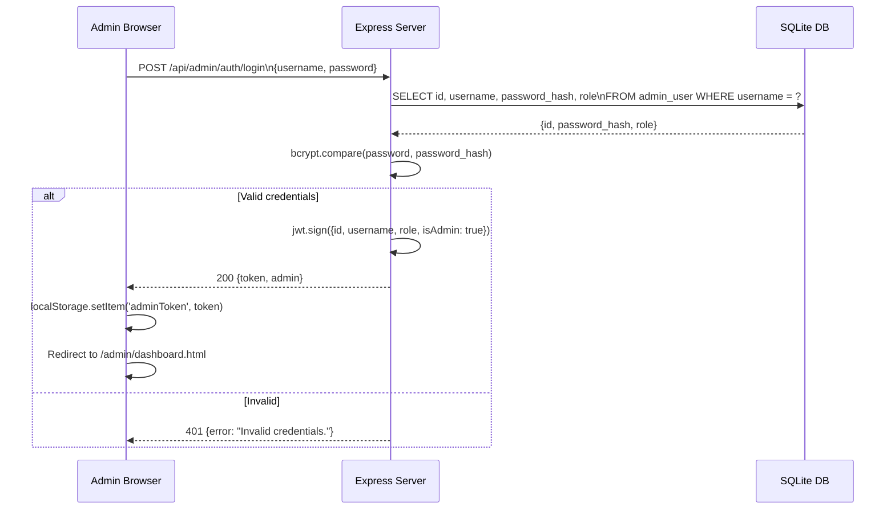

### 8. Admin Manage Products

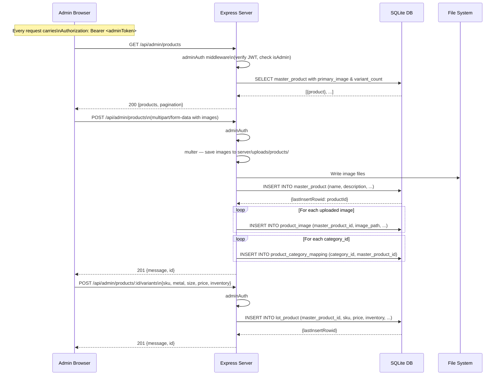

### 9. Admin Manage Orders

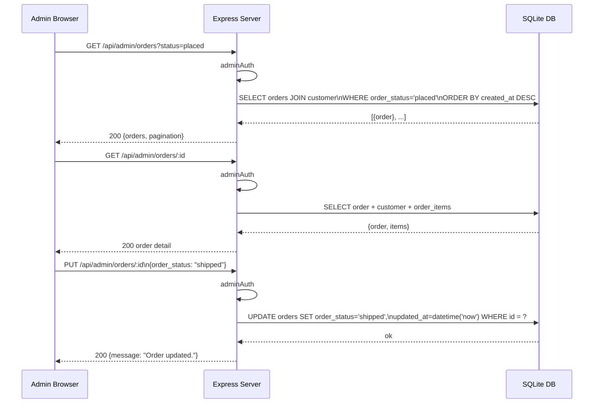

---

## Authentication Model

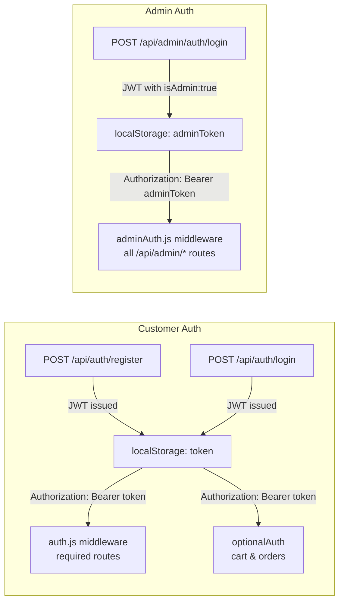

**JWT payload — customer:**
```json
{ "id": 1, "email": "user@example.com", "iat": ..., "exp": ... }
```

**JWT payload — admin:**
```json
{ "id": 1, "username": "admin", "role": "admin", "isAdmin": true, "iat": ..., "exp": ... }
```

The `adminAuth` middleware checks for the `isAdmin: true` flag and rejects tokens that do not carry it with a `403 Forbidden`.

---

## Running the Application

```bash
# 1. Install dependencies
npm install

# 2. Configure environment
cp .env.example .env   # or create .env manually — see note below

# 3. Seed the database (creates admin user + sample jewelry)
    npm run seed

# 4. Start the server
    npm run dev
# → http://localhost:3000
```

> **Note:** The sqllite branch does not ship a `.env.example`.  
> Create a `.env` file in the project root with at minimum:
>
> ```ini
> SESSION_SECRET=<long-random-string>
> JWT_SECRET=<another-long-random-string>
> JWT_EXPIRES_IN=24h
> PORT=3000
> ```

The SQLite database file is created automatically at `db/jewelry.db` on first run.

### Default admin credentials (after seeding)

| Field | Value |
|-------|-------|
| Username | `admin` |
| Password | `admin123` |
| Admin URL | `http://localhost:3000/admin/login.html` |
