# IBD Teal Jewelry — Application Documentation

> Branch: `final-1`
> Stack: **Node.js · Express · sql.js (SQLite in-process) · Vanilla JS / jQuery frontend**

---

## Table of Contents

1. [Overview](#overview)
2. [Tech Stack](#tech-stack)
3. [Project Structure](#project-structure)
4. [How the Application Works](#how-the-application-works)
   - [Customer Storefront](#customer-storefront)
   - [Admin Panel](#admin-panel)
   - [AI Chatbot (Teal)](#ai-chatbot-teal)
5. [Database Schema](#database-schema)
6. [API Reference](#api-reference)
7. [User Flow Chart](#user-flow-chart)
8. [Sequence Diagrams](#sequence-diagrams)
   - [Customer Registration](#1-customer-registration)
   - [Customer Login](#2-customer-login)
   - [Browse & Search Products](#3-browse--search-products)
   - [Add to Cart](#4-add-to-cart)
   - [Checkout & Place Order](#5-checkout--place-order)
   - [Payment Processing](#6-payment-processing)
   - [Order Tracking](#7-order-tracking)
   - [Admin Login](#8-admin-login)
   - [Admin Manage Products](#9-admin-manage-products)
   - [Admin Manage Orders](#10-admin-manage-orders)
   - [Account Management](#11-account-management)
   - [AI Chat Assistant](#12-ai-chat-assistant)
9. [Authentication Model](#authentication-model)
10. [Running the Application](#running-the-application)

---

## Overview

**IBD Teal Jewelry** is a full-stack jewelry e-commerce platform. It allows customers to browse, search, and purchase jewelry items online, while giving store administrators tools to manage the catalog and orders.

Key capabilities:

| Feature | Description |
|---|---|
| **Storefront** | Browse and filter jewelry by category or search keyword |
| **Product Detail** | View variants (metal, size, weight), images, and recommendations |
| **Shopping Cart** | Add items for both guests (session-based) and logged-in customers |
| **Checkout** | Enter billing and shipping details; supports guest and authenticated checkout |
| **Payment** | Simulated payment gateway supporting card, UPI, and net banking |
| **Order Tracking** | Look up any order by its order number |
| **Customer Account** | Profile management, order history, and saved items (wishlist) |
| **Admin Panel** | Manage products, categories, and orders through a protected admin UI |
| **AI Chatbot** | "Teal" — an AI shopping assistant powered by OpenRouter (meta-llama/llama-4-maverick) |

The server is a single **Express** process that serves static HTML/JS files and a REST API. The database is a **SQLite file** (`db/jewelry.db`) managed in-process via `sql.js` — no Docker or external database service is required.

---

## Tech Stack

| Layer | Technology |
|---|---|
| Runtime | Node.js |
| Web framework | Express 4 |
| Database | SQLite via `sql.js` (in-process, no native binary) |
| Authentication | JSON Web Tokens (`jsonwebtoken`) + `bcryptjs` |
| Session | `express-session` (used for guest cart identity) |
| File uploads | `multer` (product images saved to `server/uploads/products/`) |
| Frontend | Vanilla HTML + CSS + jQuery 3.7 |
| AI Chatbot | OpenRouter API (`meta-llama/llama-4-maverick`) |

---

## Project Structure

```
IBD-TEAL-Synergy/
├── db/
│   ├── jewelry.db          # SQLite database file (auto-created on first run)
│   ├── schema.sql          # Reference DDL (MSSQL dialect for documentation)
│   └── seed.js             # Seed script: creates admin user + sample jewelry data
├── public/                 # Static frontend (HTML + CSS + JS)
│   ├── index.html              # Homepage — featured products
│   ├── shop.html               # Full product listing with filters & pagination
│   ├── pdp.html                # Product Detail Page — variants, images, recommendations
│   ├── cart.html               # Shopping cart page
│   ├── checkout.html           # Checkout form (billing & shipping)
│   ├── payment.html            # Payment method selection & mock processing
│   ├── order-confirmation.html # Order success page
│   ├── track-order.html        # Order tracking by order number
│   ├── login.html              # Customer login / register
│   ├── my-account.html         # Account: profile, order history, saved items
│   ├── admin/                  # Admin panel pages (protected by adminToken)
│   │   ├── login.html
│   │   ├── dashboard.html
│   │   ├── products.html
│   │   ├── categories.html
│   │   └── orders.html
│   ├── css/                # Stylesheets
│   └── js/                 # Client-side JavaScript modules
├── server/
│   ├── index.js            # Express entry point — middleware, routes, static files
│   ├── config/db.js        # sql.js wrapper (init, prepare, transaction helpers)
│   ├── middleware/
│   │   ├── auth.js         # JWT guard for customer routes (required)
│   │   └── adminAuth.js    # JWT guard for admin routes (checks isAdmin flag)
│   ├── routes/
│   │   ├── authRoutes.js       # POST /api/auth/register, POST /api/auth/login
│   │   ├── productRoutes.js    # GET /api/products, GET /api/products/:id, recommendations
│   │   ├── categoryRoutes.js   # GET /api/categories
│   │   ├── cartRoutes.js       # CRUD /api/cart (guest + authenticated)
│   │   ├── orderRoutes.js      # POST /api/orders, GET /api/orders/:orderNumber
│   │   ├── paymentRoutes.js    # POST /api/payment/process (mock)
│   │   ├── accountRoutes.js    # Profile, orders, saved items (JWT required)
│   │   ├── chatRoutes.js       # POST /api/chat (AI chatbot)
│   │   └── admin/
│   │       ├── authRoutes.js       # POST /api/admin/auth/login
│   │       ├── productRoutes.js    # Full CRUD + variants + image upload
│   │       ├── categoryRoutes.js   # Full CRUD for categories
│   │       ├── orderRoutes.js      # List & update order/payment status
│   │       └── dashboardRoutes.js  # Aggregated stats + recent orders
│   └── uploads/            # Uploaded product images
├── package.json
└── README.md
```

---

## How the Application Works

### Customer Storefront

1. **Homepage / Shop** — The frontend fetches products from `GET /api/products` (with optional category slug or search keyword) and renders paginated product cards. Categories are loaded via `GET /api/categories` to populate the filter sidebar.

2. **Product Detail Page (PDP)** — Clicking a product calls `GET /api/products/:id`, which returns the product's variants (SKUs with metal, size, weight, price), images, and categories. The server also records a page-view event in `product_view`. Recommendation widgets call the bestsellers and similar-products endpoints.

3. **Cart** — Adding an item sends `POST /api/cart` with the chosen `lot_product_id`. The server checks inventory, then either inserts a new cart row or increments the quantity. Cart rows are keyed to `customer_id` (if a JWT is present) or `session_id` (for guests), allowing seamless guest checkout.

4. **Checkout** — The customer fills in billing and shipping details and submits `POST /api/orders`. The server reads the cart, validates inventory, computes `subtotal + 18% tax = order_total`, generates an order number (`ORD-YYYYMMDD-XXXX`), and runs a SQLite transaction to create the order, insert order items, decrement inventory, and clear the cart. On success, the browser is redirected to the payment page.

5. **Payment** — The payment page shows three mock methods (card, UPI, net banking). On confirmation, `POST /api/payment/process` is called. The server updates the order's `payment_status` to `'paid'` and `order_status` to `'confirmed'`, and returns a fake transaction ID. The browser then redirects to the order confirmation page.

6. **Order Tracking** — Any visitor can look up an order by number via `GET /api/orders/:orderNumber` on the track-order page.

7. **My Account** — Authenticated customers can view/edit their profile, change their password, view their full order history (with item counts), and manage their saved items (wishlist).

### Admin Panel

Admins authenticate at `/admin/login.html`, which calls `POST /api/admin/auth/login`. A JWT with `isAdmin: true` is returned and stored in `localStorage` as `adminToken`. All subsequent admin API calls include this token and are gated by the `adminAuth` middleware.

- **Dashboard** — Aggregated stats (total revenue, orders count, products count) and a list of recent orders.
- **Products** — Full CRUD: create products with image uploads, add/edit variants (SKU, metal, size, weight, price, inventory), soft-delete products.
- **Categories** — Create, rename, and delete jewelry categories; categories are linked to products via a mapping table.
- **Orders** — View all orders (filterable by status), view order details, and update `order_status` (e.g., shipped, delivered, cancelled) or `payment_status`.

### AI Chatbot (Teal)

The embedded chat widget calls `POST /api/chat` with the user's message and conversation history. The server:

1. Loads the full active product catalog from the database.
2. Searches for products matching keywords in the user's message.
3. Builds a system prompt that includes catalog context.
4. Forwards the conversation to the **OpenRouter API** (model: `meta-llama/llama-4-maverick`).
5. Returns the AI reply to the browser.

The chatbot is disabled if `OPENROUTER_API_KEY` is not set in the environment.

---

## Database Schema

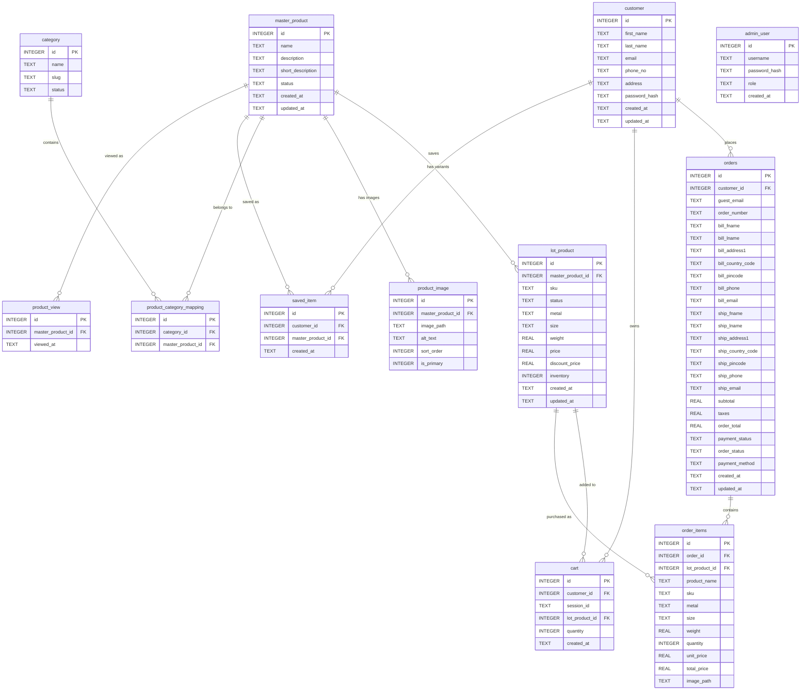

---

## API Reference

### Customer Auth — `/api/auth`

| Method | Path | Auth | Description |
|--------|------|------|-------------|
| POST | `/api/auth/register` | None | Register a new customer account |
| POST | `/api/auth/login` | None | Login; returns JWT |

### Products — `/api/products`

| Method | Path | Auth | Description |
|--------|------|------|-------------|
| GET | `/api/products` | None | List active products (pagination, category filter, search) |
| GET | `/api/products/:id` | None | Get product detail with variants, images, categories; records a page view |
| GET | `/api/products/:id/recommendations/bestsellers` | None | Best-selling products in the same categories (last 30 days) |
| GET | `/api/products/:id/recommendations/similar` | None | Most-viewed products in the same categories (last 30 days) |

### Categories — `/api/categories`

| Method | Path | Auth | Description |
|--------|------|------|-------------|
| GET | `/api/categories` | None | List active categories |

### Cart — `/api/cart`

| Method | Path | Auth | Description |
|--------|------|------|-------------|
| GET | `/api/cart` | Optional JWT | Get current cart (by customer or session) |
| POST | `/api/cart` | Optional JWT | Add item to cart |
| PUT | `/api/cart/:id` | Optional JWT | Update item quantity |
| DELETE | `/api/cart/:id` | Optional JWT | Remove item from cart |

### Orders — `/api/orders`

| Method | Path | Auth | Description |
|--------|------|------|-------------|
| POST | `/api/orders` | Optional JWT | Place order from current cart |
| GET | `/api/orders/:orderNumber` | Optional JWT | Get order details |

### Payment — `/api/payment`

| Method | Path | Auth | Description |
|--------|------|------|-------------|
| POST | `/api/payment/process` | None | Process mock payment for an order |

### Chat — `/api/chat`

| Method | Path | Auth | Description |
|--------|------|------|-------------|
| POST | `/api/chat` | None | Send message to AI assistant; returns AI reply |

### Customer Account — `/api/account`

| Method | Path | Auth | Description |
|--------|------|------|-------------|
| GET | `/api/account/profile` | Customer JWT | Get own profile |
| PUT | `/api/account/profile` | Customer JWT | Update name, phone, address |
| PUT | `/api/account/password` | Customer JWT | Change password (requires current password) |
| GET | `/api/account/orders` | Customer JWT | List own orders with item counts |
| GET | `/api/account/orders/:id` | Customer JWT | Get order detail (own orders only) |
| GET | `/api/account/saved` | Customer JWT | List saved/wishlisted products |
| POST | `/api/account/saved` | Customer JWT | Save a product to wishlist |
| DELETE | `/api/account/saved/:productId` | Customer JWT | Remove from wishlist |
| GET | `/api/account/saved/check/:productId` | Customer JWT | Check if a product is saved |

### Admin Auth — `/api/admin/auth`

| Method | Path | Auth | Description |
|--------|------|------|-------------|
| POST | `/api/admin/auth/login` | None | Admin login; returns JWT with `isAdmin: true` |

### Admin Products — `/api/admin/products`

| Method | Path | Auth | Description |
|--------|------|------|-------------|
| GET | `/api/admin/products` | Admin JWT | List all products |
| GET | `/api/admin/products/:id` | Admin JWT | Get product with variants & images |
| POST | `/api/admin/products` | Admin JWT | Create product (multipart with images) |
| PUT | `/api/admin/products/:id` | Admin JWT | Update product |
| DELETE | `/api/admin/products/:id` | Admin JWT | Soft-delete product |
| POST | `/api/admin/products/:id/variants` | Admin JWT | Add a variant (SKU) |
| PUT | `/api/admin/products/variants/:variantId` | Admin JWT | Update a variant |

### Admin Categories — `/api/admin/categories`

| Method | Path | Auth | Description |
|--------|------|------|-------------|
| GET | `/api/admin/categories` | Admin JWT | List categories |
| POST | `/api/admin/categories` | Admin JWT | Create category |
| PUT | `/api/admin/categories/:id` | Admin JWT | Update category |
| DELETE | `/api/admin/categories/:id` | Admin JWT | Delete category |

### Admin Orders — `/api/admin/orders`

| Method | Path | Auth | Description |
|--------|------|------|-------------|
| GET | `/api/admin/orders` | Admin JWT | List all orders (filterable by status) |
| GET | `/api/admin/orders/:id` | Admin JWT | Get order detail |
| PUT | `/api/admin/orders/:id` | Admin JWT | Update order/payment status |

### Admin Dashboard — `/api/admin/dashboard`

| Method | Path | Auth | Description |
|--------|------|------|-------------|
| GET | `/api/admin/dashboard` | Admin JWT | Aggregated stats + recent orders |

---

## User Flow Chart

The diagram below shows every path a user (customer or admin) can take through the application.

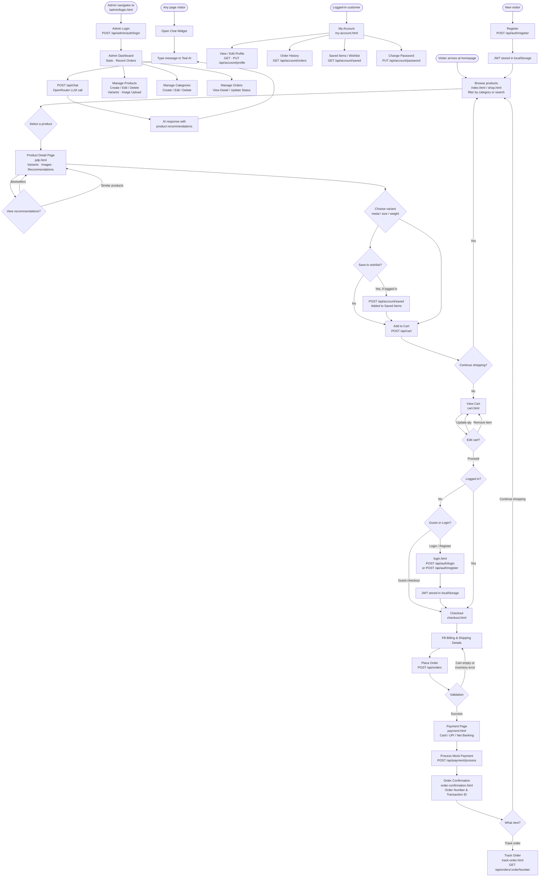

---

## Sequence Diagrams

### 1. Customer Registration

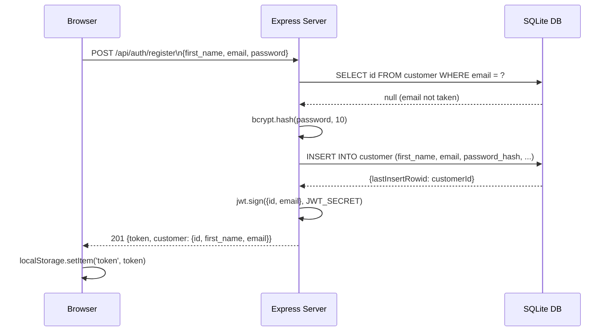

### 2. Customer Login

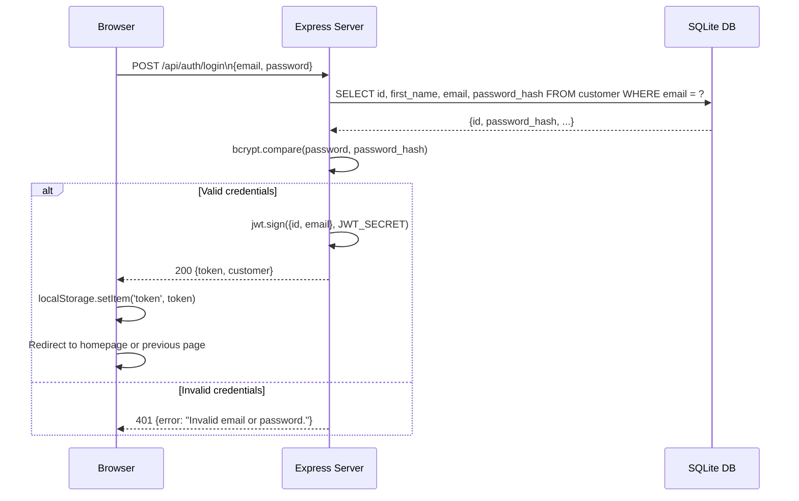

### 3. Browse & Search Products

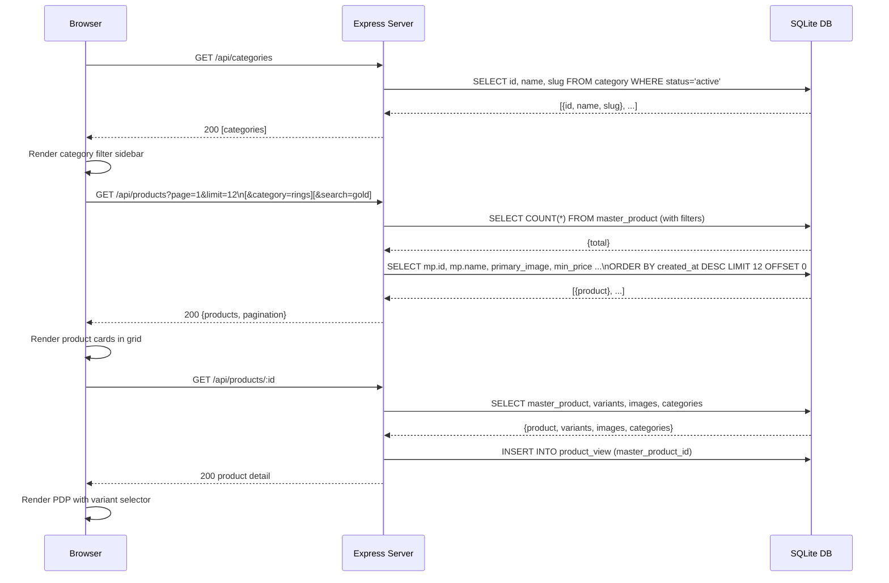

### 4. Add to Cart

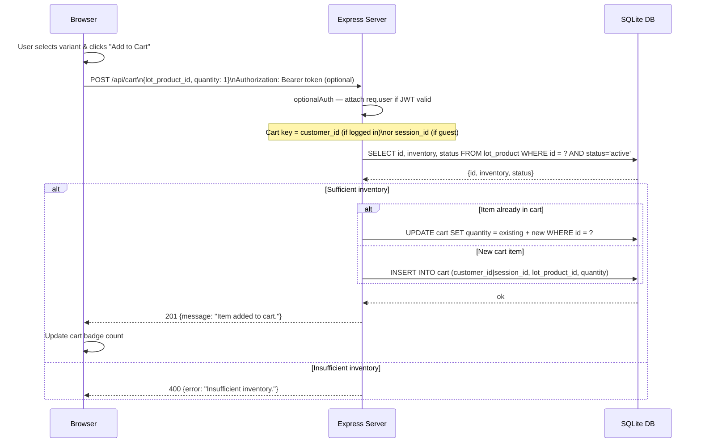

### 5. Checkout & Place Order

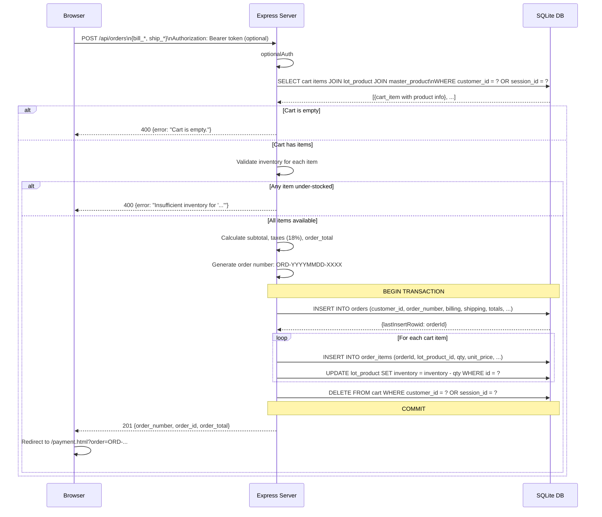

### 6. Payment Processing

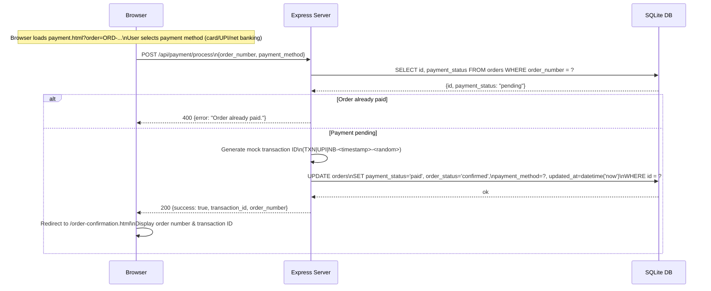

### 7. Order Tracking

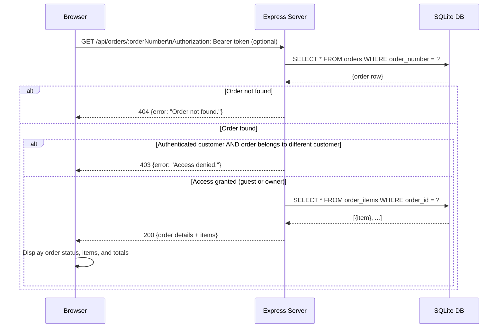

### 8. Admin Login

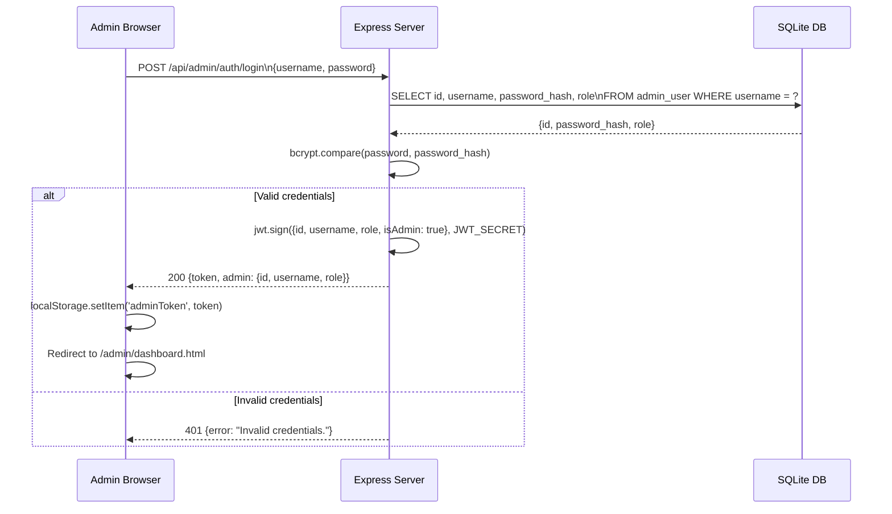

### 9. Admin Manage Products

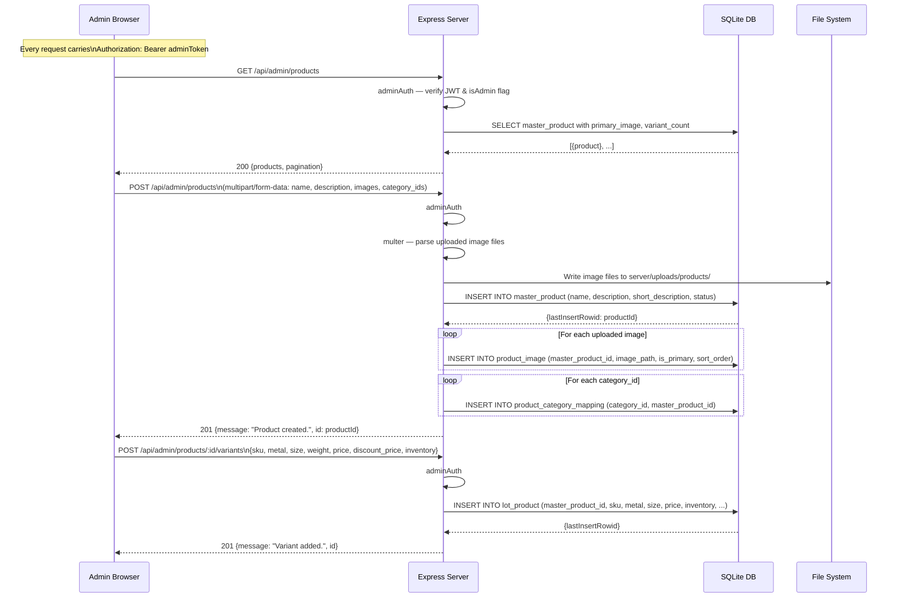

### 10. Admin Manage Orders

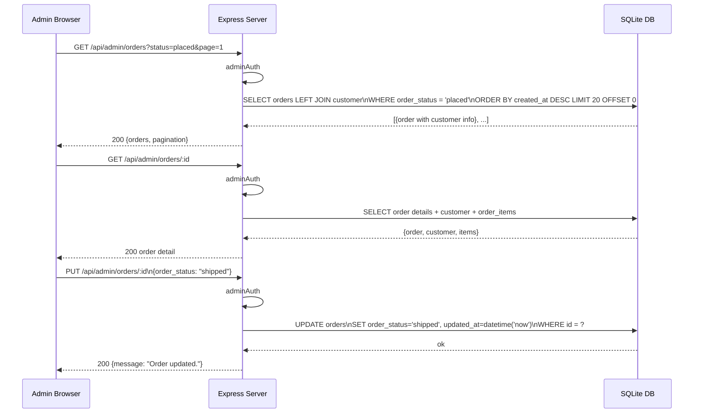

### 11. Account Management

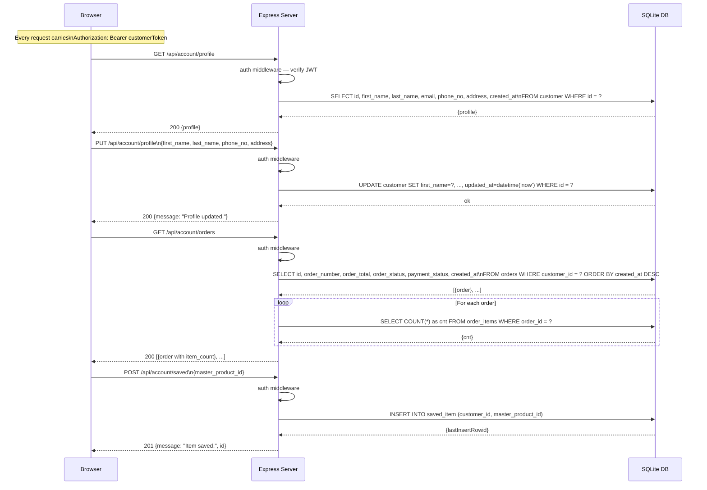

### 12. AI Chat Assistant

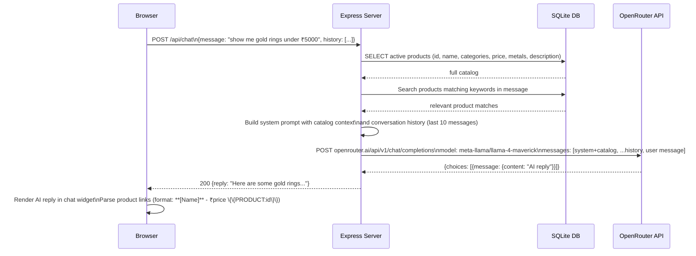

---

## Authentication Model

```mermaid
flowchart LR
    subgraph Customer Auth
        C1[POST /api/auth/register] -->|JWT issued| C2[localStorage: token]
        C3[POST /api/auth/login]    -->|JWT issued| C2
        C2 -->|Authorization: Bearer token| C4[auth.js middleware\nrequired routes]
        C2 -->|Authorization: Bearer token| C5[optionalAuth\ncart & orders]
        C4 --> C6[/api/account/*\nProfile · Orders · Saved Items]
    end

    subgraph Admin Auth
        A1[POST /api/admin/auth/login] -->|JWT with isAdmin:true| A2[localStorage: adminToken]
        A2 -->|Authorization: Bearer adminToken| A3[adminAuth.js middleware\nall /api/admin/* routes]
        A3 --> A4[Admin Products · Categories · Orders · Dashboard]
    end
```

**JWT payload — customer:**
```json
{ "id": 1, "email": "user@example.com", "iat": 1700000000, "exp": 1700086400 }
```

**JWT payload — admin:**
```json
{ "id": 1, "username": "admin", "role": "admin", "isAdmin": true, "iat": 1700000000, "exp": 1700086400 }
```

The `adminAuth` middleware checks for the `isAdmin: true` flag and rejects any token that does not carry it with a `403 Forbidden` response.

---

## Running the Application

```bash
# 1. Install dependencies
npm install

# 2. Create environment file
# Create a .env file in the project root:
# SESSION_SECRET=<long-random-string>
# JWT_SECRET=<another-long-random-string>
# JWT_EXPIRES_IN=24h
# PORT=3000
# OPENROUTER_API_KEY=<your-key>   # Optional: enables the AI chatbot

# 3. Seed the database (creates admin user + sample jewelry data)
npm run seed

# 4. Start the server
npm run dev
# → http://localhost:3000
```

### Application URLs

| URL | Description |
|-----|-------------|
| `http://localhost:3000/` | Customer homepage |
| `http://localhost:3000/shop.html` | Product listing |
| `http://localhost:3000/pdp.html?id=1` | Product detail |
| `http://localhost:3000/cart.html` | Shopping cart |
| `http://localhost:3000/checkout.html` | Checkout |
| `http://localhost:3000/payment.html?order=ORD-...` | Payment |
| `http://localhost:3000/order-confirmation.html` | Order success |
| `http://localhost:3000/track-order.html` | Track order |
| `http://localhost:3000/login.html` | Customer login / register |
| `http://localhost:3000/my-account.html` | Customer account |
| `http://localhost:3000/admin/login.html` | Admin login |
| `http://localhost:3000/admin/dashboard.html` | Admin dashboard |

### Default Admin Credentials (after seeding)

| Field | Value |
|-------|-------|
| Username | `admin` |
| Password | `admin123` |
| Admin URL | `http://localhost:3000/admin/login.html` |
