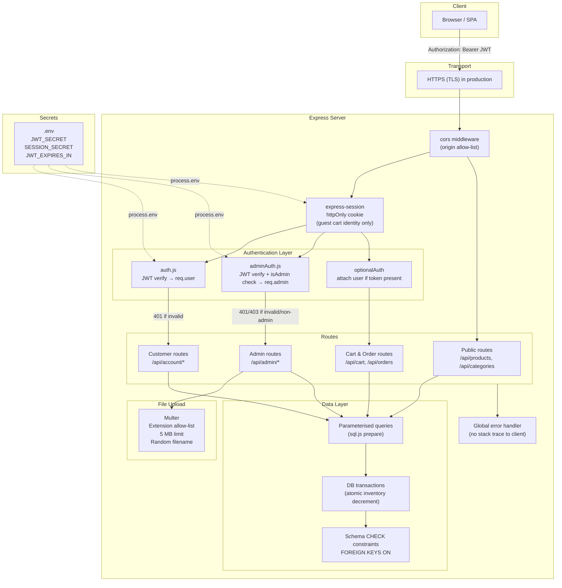
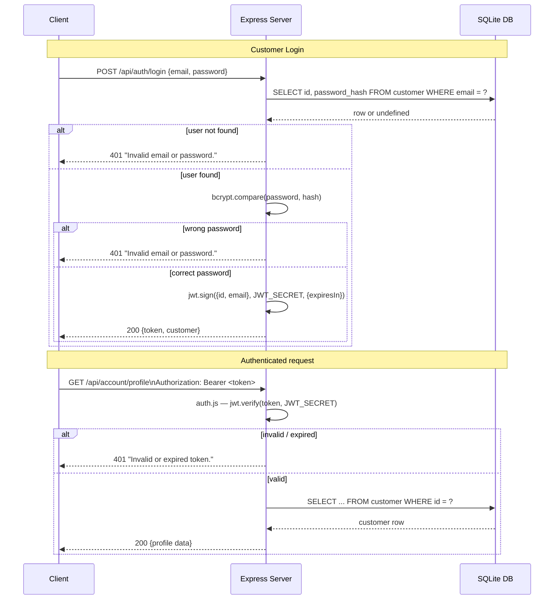

# Security Standards & Architecture

This document describes every security control implemented in the IBD-TEAL Jewelry e-commerce application — **what** it protects against, **where** in the code it lives, and **how** it works.

---

## Table of Contents

1. [Authentication Architecture](#1-authentication-architecture)
2. [Password Storage](#2-password-storage)
3. [Session Management](#3-session-management)
4. [Authorisation & Access Control](#4-authorisation--access-control)
5. [SQL Injection Prevention](#5-sql-injection-prevention)
6. [File Upload Security](#6-file-upload-security)
7. [Input Validation](#7-input-validation)
8. [Cross-Origin Resource Sharing (CORS)](#8-cross-origin-resource-sharing-cors)
9. [Environment Variables & Secrets](#9-environment-variables--secrets)
10. [Database Integrity Constraints](#10-database-integrity-constraints)
11. [Error Handling](#11-error-handling)
12. [Security Architecture Diagram](#12-security-architecture-diagram)
13. [Known Limitations & Recommendations](#13-known-limitations--recommendations)

---

## 1. Authentication Architecture

The application uses **JSON Web Tokens (JWT)** for stateless authentication. There are two separate token flows — one for customers and one for admin users — each using a different JWT payload and different middleware.

### 1.1 Customer Authentication

| Step | Endpoint | What happens |
|------|----------|--------------|
| Register | `POST /api/auth/register` | Password hashed with bcrypt; JWT issued on success |
| Login | `POST /api/auth/login` | Credentials verified; JWT issued on success |
| Protected access | Any `/api/account/*` route | `auth.js` middleware validates the token |

**JWT payload (customer):**
```json
{ "id": 1, "email": "customer@example.com", "iat": 1700000000, "exp": 1700086400 }
```

The token is stored in the browser's `localStorage` as `token` and sent with every subsequent request in the `Authorization: Bearer <token>` header.

### 1.2 Admin Authentication

| Step | Endpoint | What happens |
|------|----------|--------------|
| Login | `POST /api/admin/auth/login` | Credentials verified; JWT with `isAdmin: true` issued |
| Protected access | Any `/api/admin/*` route | `adminAuth.js` middleware validates token **and** checks `isAdmin` flag |

**JWT payload (admin):**
```json
{ "id": 1, "username": "admin", "role": "admin", "isAdmin": true, "iat": 1700000000, "exp": 1700086400 }
```

The token is stored in `localStorage` as `adminToken`.

### 1.3 Token Verification

Both `auth.js` and `adminAuth.js` call `jwt.verify(token, process.env.JWT_SECRET)`. Any tampered, expired, or structurally invalid token causes an immediate `401 Unauthorized` response. The `adminAuth.js` middleware adds a second check: if the decoded payload does not contain `isAdmin: true` the request is rejected with `403 Forbidden`.

```
Source files:
  server/middleware/auth.js
  server/middleware/adminAuth.js
  server/routes/authRoutes.js
  server/routes/admin/authRoutes.js
```

---

## 2. Password Storage

Passwords are **never stored in plain text**. The application uses **bcryptjs** (a pure-JavaScript bcrypt implementation) with a cost factor of **10**.

| Operation | Code location | Detail |
|-----------|---------------|--------|
| Hash on register | `server/routes/authRoutes.js` — `POST /register` handler | `bcrypt.hash(password, 10)` |
| Hash on password change | `server/routes/accountRoutes.js` — `PUT /password` handler | `bcrypt.hash(newPassword, 10)` |
| Verify on login (customer) | `server/routes/authRoutes.js` — `POST /login` handler | `bcrypt.compare(password, hash)` |
| Verify on login (admin) | `server/routes/admin/authRoutes.js` — `POST /login` handler | `bcrypt.compare(password, hash)` |
| Verify on password change | `server/routes/accountRoutes.js` — `PUT /password` handler | `bcrypt.compare(currentPassword, hash)` |

**Why bcrypt?**  
bcrypt is a one-way adaptive hash function that embeds a random salt in each hash. The cost factor (10) means the hash requires ~2¹⁰ = 1024 iterations, making brute-force and rainbow-table attacks computationally expensive.

**Generic error messages:**  
Login failures return `"Invalid email or password."` for both "not found" and "wrong password" cases — this prevents user-enumeration attacks via timing or message differences.

---

## 3. Session Management

`express-session` is used **only** for guest cart identity — not for authentication. A session cookie is created on every first visit and is used to associate a shopping cart row with an anonymous browser.

Configuration (`server/app.js`):

```js
// ⚠️  Set SESSION_SECRET to a strong random string in production.
// The fallback 'test-secret' is present in the source for local dev only and
// must never be used in a deployed environment.
app.use(session({
    secret: process.env.SESSION_SECRET || 'test-secret',
    resave: false,
    saveUninitialized: true,
    cookie: {
        maxAge: 24 * 60 * 60 * 1000,  // 24 hours
        secure: process.env.NODE_ENV === 'production',  // HTTPS-only in prod
        httpOnly: true                  // not accessible from JavaScript
    }
}));
```

| Cookie attribute | Value | Protects against |
|-----------------|-------|-----------------|
| `httpOnly: true` | Always | XSS-based cookie theft |
| `secure: true` | In production | Cookie interception over plain HTTP |
| `maxAge` | 24 h | Indefinitely-lived session cookies |
| `resave: false` | — | Unnecessary session saves that would expand attack surface |

> **Note:** The `SESSION_SECRET` environment variable **must** be set to a strong random string in production. The fallback `'test-secret'` is intentionally weak and only for local development.

---

## 4. Authorisation & Access Control

### 4.1 Middleware layers

```
Incoming request
        │
        ├─ /api/account/*    ──► auth.js (required JWT)
        │                              └─ 401 if missing / invalid
        │
        ├─ /api/admin/*      ──► adminAuth.js (required JWT + isAdmin)
        │                              └─ 401 if missing / invalid
        │                              └─ 403 if isAdmin ≠ true
        │
        ├─ /api/cart/*       ──► optionalAuth (attaches user if JWT present)
        ├─ /api/orders/*     ──► optionalAuth (attaches user if JWT present)
        │
        └─ public routes     ──► no auth required
```

### 4.2 Resource-level ownership checks

Beyond route-level middleware, the application enforces **row-level access control** to prevent authenticated users from accessing other users' data:

| Route | Check |
|-------|-------|
| `GET /api/orders/:orderNumber` | If the order has a `customer_id`, it must match `req.user.id`; otherwise `403` |
| `GET /api/account/orders/:id` | SQL query includes `AND customer_id = ?` (only the owner's orders are returned) |
| `PUT/DELETE /api/cart/:id` | SQL includes `AND customer_id = ?` or `AND session_id = ?` so a user cannot modify another user's cart row |
| `GET /api/account/saved/*` | All queries filter by `customer_id = req.user.id` |

### 4.3 Admin role separation

Admin users carry a `role` field (`admin` or `editor`) in both the database and the JWT payload. The `adminAuth` middleware exposes this as `req.admin.role`, allowing future route-level role checks to be added without changing the middleware itself.

---

## 5. SQL Injection Prevention

All database interactions use **parameterised queries** through the sql.js wrapper's `prepare().get()`, `prepare().all()`, and `prepare().run()` methods. User-controlled input is **always** passed as a separate parameter — never interpolated into the SQL string.

**Example — safe:**
```js
// User input (email) is bound as a parameter, never concatenated
db.prepare('SELECT id FROM customer WHERE email = ?').get(email);
```

**Example — what we do NOT do (unsafe):**
```js
// Never done in this codebase:
db.exec(`SELECT * FROM customer WHERE email = '${email}'`); // ❌
```

Dynamic WHERE clauses (e.g., admin order filtering) are built by appending static string fragments (`' WHERE order_status = ?'`) with the variable value always placed in the params array.

The database is also initialised with:
```js
_db.run("PRAGMA foreign_keys = ON");
```
which enforces referential integrity at the database engine level.

```
Source file: server/config/db.js
```

---

## 6. File Upload Security

Product image uploads are handled by **Multer** (`server/routes/admin/productRoutes.js`). Three controls are applied:

| Control | Configuration | Protects against |
|---------|--------------|-----------------|
| **MIME / extension allow-list** | `.jpg`, `.jpeg`, `.png`, `.gif`, `.webp` only | Uploading server-side scripts (`.php`, `.js`, `.sh`, etc.) |
| **File size cap** | 5 MB per file | Denial-of-service via oversized uploads |
| **Randomised filename** | `Date.now() + random + originalExtension` | Path traversal, filename collisions, overwriting existing files |
| **Isolated storage directory** | `server/uploads/products/` | Keeps uploaded content separate from application code |
| **Admin JWT required** | `adminAuth` applied to the entire router | Only authenticated admins can upload files |

```js
// Multer config excerpt (server/routes/admin/productRoutes.js)
const upload = multer({
    storage,                             // disk storage with random filename
    fileFilter: (req, file, cb) => {
        const allowed = ['.jpg', '.jpeg', '.png', '.gif', '.webp'];
        const ext = path.extname(file.originalname).toLowerCase();
        allowed.includes(ext) ? cb(null, true) : cb(new Error('Only image files are allowed.'));
    },
    limits: { fileSize: 5 * 1024 * 1024 }  // 5 MB
});
```

---

## 7. Input Validation

All routes perform **server-side validation** before touching the database. Client-side validation is never relied upon as a security control.

| Route | Fields validated |
|-------|-----------------|
| `POST /api/auth/register` | `first_name`, `email`, `password` required |
| `POST /api/auth/login` | `email`, `password` required |
| `PUT /api/account/password` | `current_password`, `new_password` required; `new_password` must be ≥ 6 characters |
| `POST /api/orders` | All billing and shipping fields required (11 fields each) |
| `POST /api/cart` | `lot_product_id` required; quantity must not exceed available inventory |
| `PUT /api/cart/:id` | `quantity` must be ≥ 1; inventory re-checked |
| `POST /api/admin/auth/login` | `username`, `password` required |
| `POST /api/admin/products` | `name` required |
| `POST /api/admin/products/:id/variants` | `sku`, `price` required |
| Numeric path params | All `:id` and `:productId` params are parsed with `parseInt()` and rejected with `400` if `isNaN` |

Inventory is checked **twice** for order placement: once before the transaction begins (fast fail) and the decrement is performed atomically inside a database transaction so concurrent requests cannot oversell.

---

## 8. Cross-Origin Resource Sharing (CORS)

The `cors` npm package is applied globally via `app.use(cors())` in `server/app.js`. In the current configuration this allows all origins (suitable for development).

> **Production recommendation:** Configure explicit allowed origins:
> ```js
> app.use(cors({ origin: 'https://your-domain.com' }));
> ```

---

## 9. Environment Variables & Secrets

All secrets are loaded from the process environment via `dotenv` and are **never hardcoded** in source files.

| Variable | Purpose | Fallback (dev only) |
|----------|---------|---------------------|
| `JWT_SECRET` | Signs and verifies all JWTs | none — server will fail on first token operation if unset |
| `JWT_EXPIRES_IN` | Customer JWT lifetime (e.g. `24h`) | none — server will fail on first token issue if unset |
| `SESSION_SECRET` | Signs the session cookie | `'test-secret'` (**intentionally weak** — must be overridden in production) |

`.env` is listed in `.gitignore` so secrets are never committed to the repository. A `.env.example` template documents which variables must be set.

**Admin JWT lifetime** is hardcoded to `'12h'` in the admin login route handler (`server/routes/admin/authRoutes.js`), providing a shorter session window for the higher-privilege account.

---

## 10. Database Integrity Constraints

The schema (`server/config/db.js`) enforces data correctness at the database level, providing a last line of defence against malformed data reaching persistence:

| Table | Constraint | Effect |
|-------|-----------|--------|
| `customer` | `email TEXT NOT NULL UNIQUE` | Prevents duplicate accounts |
| `admin_user` | `role CHECK(role IN ('admin','editor'))` | Prevents invalid roles |
| `orders` | `payment_status CHECK(... IN ('pending','paid','failed','refunded'))` | Prevents invalid payment states |
| `orders` | `order_status CHECK(... IN ('placed','confirmed','shipped','delivered','cancelled'))` | Prevents invalid order states |
| `lot_product` | `price CHECK(price >= 0)`, `inventory CHECK(inventory >= 0)` | Prevents negative prices / stock |
| `order_items` | `quantity CHECK(quantity > 0)`, `unit_price CHECK(unit_price >= 0)` | Prevents zero/negative quantities |
| All foreign keys | `PRAGMA foreign_keys = ON` | Prevents orphaned rows |
| `saved_item` | `UNIQUE(customer_id, master_product_id)` | Prevents duplicate wishlist entries |

---

## 11. Error Handling

A global error-handling middleware in `server/app.js` catches any unhandled Express errors:

```js
app.use(function (err, req, res, next) {
    console.error(err.stack);
    res.status(500).json({ error: 'Something went wrong' });
});
```

This ensures that:
- Internal stack traces are **never exposed** to the client.
- All unexpected errors return a uniform `500` JSON response.
- The full error is logged server-side for debugging.

Individual route handlers also use `try/catch` blocks that log the error internally and return a generic message, preventing information leakage through error details.

---

## 12. Security Architecture Diagram



### Authentication flow in detail



---

## 13. Known Limitations & Recommendations

The following items represent security improvements that are **not yet implemented** but are recommended before a production deployment:

| # | Area | Current state | Recommendation |
|---|------|--------------|---------------|
| 1 | **Rate limiting** | No rate limiting on auth endpoints | Add `express-rate-limit` to `/api/auth/login` and `/api/admin/auth/login` to mitigate brute-force attacks |
| 2 | **CORS** | All origins allowed (`cors()`) | Restrict to production domain(s) with an explicit `origin` allow-list |
| 3 | **HTTPS** | `secure` cookie flag relies on `NODE_ENV=production` | Enforce HTTPS at the reverse-proxy/CDN layer and set `NODE_ENV=production` in all production environments |
| 4 | **Helmet** | No HTTP security headers set | Add `helmet` middleware to set `Content-Security-Policy`, `X-Frame-Options`, `X-Content-Type-Options`, `Strict-Transport-Security`, etc. |
| 5 | **Session secret fallback** | Falls back to `'test-secret'` if env var missing | Remove the fallback and throw on startup if `SESSION_SECRET` is absent |
| 6 | **Admin JWT expiry** | Hardcoded `'12h'` | Make configurable via `ADMIN_JWT_EXPIRES_IN` environment variable |
| 7 | **Payment processing** | Mock implementation only | Replace with a PCI-DSS compliant payment gateway (e.g. Stripe, Razorpay) before accepting real transactions |
| 8 | **Audit logging** | No audit trail for admin actions | Log admin write operations (create/update/delete) with timestamp and admin ID |
| 9 | **Password policy** | Minimum 6 characters only | Enforce stronger policy (uppercase, digit, symbol) |
| 10 | **CSRF** | Session cookie has no CSRF protection | Add `csurf` or use the `SameSite=Strict` cookie attribute once sessions carry more privilege |
